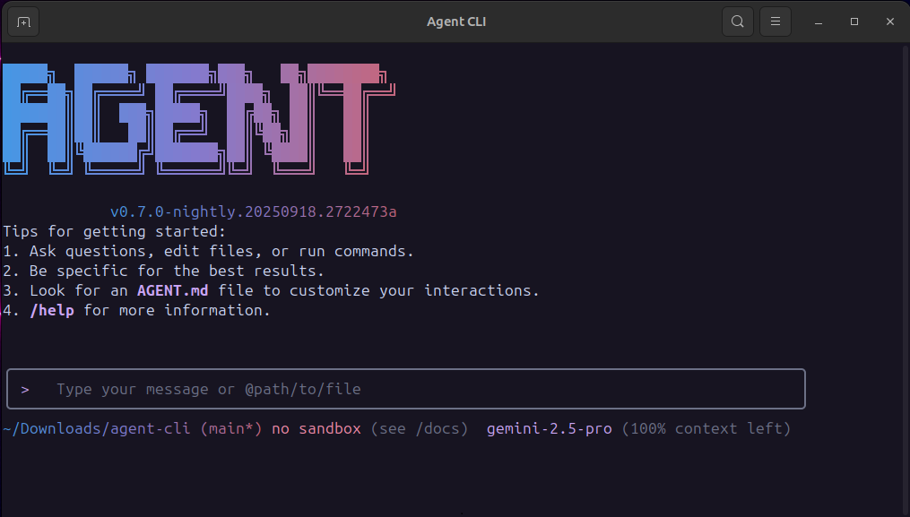

# Agent CLI

<div align="center">



[](https://www.npmjs.com/package/@agent-cli/agent-cli)
[](./LICENSE)
[](https://nodejs.org/)
[](https://www.npmjs.com/package/@agent-cli/agent-cli)

**AI-powered command-line workflow tool for developers**

[Installation](#installation) • [Quick Start](#quick-start) • [Features](#key-features) • [Documentation](./docs/) • [Contributing](./CONTRIBUTING.md)

</div>

Agent CLI is a powerful command-line AI workflow tool optimized for use with many differnt models. It enhances your development workflow with advanced code understanding, automated tasks, and intelligent assistance.

## 💡 Free Options Available

Get started with Agent CLI at no cost using any of these free options:

### 🔥 Qwen OAuth (Recommended)

- **2,000 requests per day** with no token limits
- **60 requests per minute** rate limit
- Simply run `agent` and authenticate with your qwen.ai account
- Automatic credential management and refresh
- Use `/auth` command to switch to Qwen OAuth if you have initialized with OpenAI compatible mode

### 🌟 Google OAuth & VertexAI

- **60 requests/min and 1,000 requests/day** with personal Google account
- **Access to powerful Gemini 2.5 Pro** with 1M token context window
- **Built-in tools**: Google Search grounding, file operations, shell commands, web fetching
- **Enterprise features**: Advanced security and compliance with Vertex AI
- **Scalable**: Higher rate limits with billing account through Vertex AI

### 🌏 Regional Free Tiers

- **International**: OpenRouter provides **up to 1,000 free API calls per day** worldwide

For detailed setup instructions, see [Authorization](#authorization).

> [!WARNING]
> **Token Usage Notice**: Agent CLI may issue multiple API calls per cycle, resulting in higher token usage (similar to Claude Code). We're actively optimizing API efficiency.

## Key Features

- **Code Understanding & Editing** - Query and edit large codebases beyond traditional context window limits
- **Workflow Automation** - Automate operational tasks like handling pull requests and complex rebases
- **Enhanced Parser** - Adapted parser specifically optimized for Qwen-Coder models
- **Vision Model Support** - Automatically detect images in your input and seamlessly switch to vision-capable models for multimodal analysis

## Installation

### Prerequisites

Ensure you have [Node.js version 20](https://nodejs.org/en/download) or higher installed.

```bash
curl -qL https://www.npmjs.com/install.sh | sh
```

### Install from npm

```bash
npm install -g @agent-cli/agent-cli@latest
agent --version
```

### Install from source

```bash
git clone https://github.com/agent-cli/agent-cli.git
cd agent-cli
npm install
npm install -g .
```

### Install globally with Homebrew (macOS/Linux)

```bash
brew install agent-cli
```

## Quick Start

```bash
# Start Agent CLI
agent

# Example commands
> Explain this codebase structure
> Help me refactor this function
> Generate unit tests for this module
```

### Session Management

Control your token usage with configurable session limits to optimize costs and performance.

#### Configure Session Token Limit

Create or edit `.agent/settings.json` in your home directory:

```json
{
  "sessionTokenLimit": 32000
}
```

#### Session Commands

- **`/compress`** - Compress conversation history to continue within token limits
- **`/clear`** - Clear all conversation history and start fresh
- **`/stats`** - Check current token usage and limits

> 📝 **Note**: Session token limit applies to a single conversation, not cumulative API calls.

### Vision Model Configuration

Agent CLI includes intelligent vision model auto-switching that detects images in your input and can automatically switch to vision-capable models for multimodal analysis. **This feature is enabled by default** - when you include images in your queries, you'll see a dialog asking how you'd like to handle the vision model switch.

#### Skip the Switch Dialog (Optional)

If you don't want to see the interactive dialog each time, configure the default behavior in your `.agent/settings.json`:

```json
{
  "experimental": {
    "vlmSwitchMode": "once"
  }
}
```

**Available modes:**

- **`"once"`** - Switch to vision model for this query only, then revert
- **`"session"`** - Switch to vision model for the entire session
- **`"persist"`** - Continue with current model (no switching)
- **Not set** - Show interactive dialog each time (default)

#### Command Line Override

You can also set the behavior via command line:

```bash
# Switch once per query
agent --vlm-switch-mode once

# Switch for entire session
agent --vlm-switch-mode session

# Never switch automatically
agent --vlm-switch-mode persist
```

#### Disable Vision Models (Optional)

To completely disable vision model support, add to your `.agent/settings.json`:

```json
{
  "experimental": {
    "visionModelPreview": false
  }
}
```

> 💡 **Tip**: In YOLO mode (`--yolo`), vision switching happens automatically without prompts when images are detected.

### Authorization

Choose your preferred authentication method based on your needs:

#### 1. Qwen OAuth (🚀 Recommended - Start in 30 seconds)

The easiest way to get started - completely free with generous quotas:

```bash
# Just run this command and follow the browser authentication
agent
```

**What happens:**

1. **Instant Setup**: CLI opens your browser automatically
2. **One-Click Login**: Authenticate with your qwen.ai account
3. **Automatic Management**: Credentials cached locally for future use
4. **No Configuration**: Zero setup required - just start coding!

**Free Tier Benefits:**

- ✅ **2,000 requests/day** (no token counting needed)
- ✅ **60 requests/minute** rate limit
- ✅ **Automatic credential refresh**
- ✅ **Zero cost** for individual users
- ℹ️ **Note**: Model fallback may occur to maintain service quality

### 2. Login with Google (OAuth)

Alternative authentication option with Google services:

**Benefits:**

- **Free tier** with 60 requests/min and 1,000 requests/day
- **Access to Gemini 2.5 Pro and Flash** with 1M token context window
- **No API key management** - just sign in with your Google account
- **Automatic updates** to latest models

#### 3. Vertex AI

Best for enterprise teams and production workloads:

**Benefits:**

- **Enterprise features**: Advanced security and compliance
- **Scalable**: Higher rate limits with billing account
- **Integration**: Works with existing Google Cloud infrastructure

#### 4. OpenAI-Compatible API

Use API keys for OpenAI or other compatible providers:

**Configuration Methods:**

1. **Environment Variables**

   ```bash
   export OPENAI_API_KEY="your_api_key_here"
   export OPENAI_BASE_URL="your_api_endpoint"
   export OPENAI_MODEL="your_model_choice"
   ```

2. **Project `.env` File**
   Create a `.env` file in your project root:
   ```env
   OPENAI_API_KEY=your_api_key_here
   OPENAI_BASE_URL=your_api_endpoint
   OPENAI_MODEL=your_model_choice
   ```

**API Provider Options**

> ⚠️ **Regional Notice:**
>
> - **Mainland China**: Use Alibaba Cloud Bailian or ModelScope
> - **International**: Use Alibaba Cloud ModelStudio or OpenRouter

<details>
<summary><b>🇨🇳 For Users in Mainland China</b></summary>

**Option 1: Alibaba Cloud Bailian** ([Apply for API Key](https://bailian.console.aliyun.com/))

```bash
export OPENAI_API_KEY="your_api_key_here"
export OPENAI_BASE_URL="https://dashscope.aliyuncs.com/compatible-mode/v1"
export OPENAI_MODEL="qwen3-coder-plus"
```

**Option 2: ModelScope (Free Tier)** ([Apply for API Key](https://modelscope.cn/docs/model-service/API-Inference/intro))

- ✅ **2,000 free API calls per day**
- ⚠️ Connect your Aliyun account to avoid authentication errors

```bash
export OPENAI_API_KEY="your_api_key_here"
export OPENAI_BASE_URL="https://api-inference.modelscope.cn/v1"
export OPENAI_MODEL="Qwen/Qwen3-Coder-480B-A35B-Instruct"
```

</details>

<details>
<summary><b>🌍 For International Users</b></summary>

**Option 1: Alibaba Cloud ModelStudio** ([Apply for API Key](https://modelstudio.console.alibabacloud.com/))

```bash
export OPENAI_API_KEY="your_api_key_here"
export OPENAI_BASE_URL="https://dashscope-intl.aliyuncs.com/compatible-mode/v1"
export OPENAI_MODEL="qwen3-coder-plus"
```

**Option 2: OpenRouter (Free Tier Available)** ([Apply for API Key](https://openrouter.ai/))

```bash
export OPENAI_API_KEY="your_api_key_here"
export OPENAI_BASE_URL="https://openrouter.ai/api/v1"
export OPENAI_MODEL="qwen/qwen3-coder:free"
```

</details>

## Commands & Shortcuts

### Session Commands

- `/help` - Display available commands
- `/clear` - Clear conversation history
- `/compress` - Compress history to save tokens
- `/stats` - Show current session information
- `/exit` or `/quit` - Exit Agent CLI

### Keyboard Shortcuts

- `Ctrl+C` - Cancel current operation
- `Ctrl+D` - Exit (on empty line)
- `Up/Down` - Navigate command history


## Development & Contributing

See [CONTRIBUTING.md](./CONTRIBUTING.md) to learn how to contribute to the project.

For detailed authentication setup, see the [authentication guide](./docs/cli/authentication.md).

## Troubleshooting

If you encounter issues, check the [troubleshooting guide](docs/troubleshooting.md).

## Acknowledgments

This project is adapted from [Google Gemini CLI](https://github.com/google-gemini/gemini-cli) and [Qwen Code](https://github.com/agent-cli-robot/qwen-code). We acknowledge and appreciate the excellent work of the Gemini CLI team. Our main contribution focuses on parser-level adaptations to better support Qwen-Coder models.

## License

[LICENSE](./LICENSE)

## Star History

[](https://www.star-history.com/#agent-cli/agent-cli&Date)
